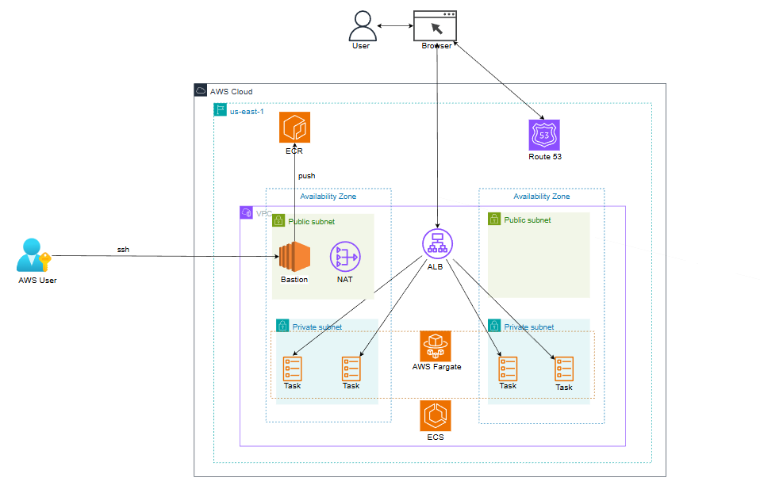

# 🏗️ Infrastructure Architecture Documentation

## 📋 **Overview**

This document describes the complete AWS infrastructure architecture for the Node.js ECS application with custom domain and SSL certificate. The infrastructure is deployed using Terraform and follows AWS best practices for security, scalability, and high availability.

## 🖼️ **Infrastructure Architecture Overview**

*Complete AWS infrastructure architecture diagram showing VPC, ALB, ECS Fargate, Route53, and other components*

## 🎥 **Video Demo**

### **Infrastructure Deployment Demo**

**Video Link**: https://drive.google.com/drive/folders/1Fqa7kUk4zMIXwUvzIUZi24yXWA2WYLEb?hl=vi

*Demo video showing the complete deployment process including:*
- *Infrastructure provisioning with Terraform*
- *CI/CD pipeline execution with GitHub Actions*
- *Live application testing*
---
*This documentation provides a comprehensive overview of the AWS infrastructure architecture for production deployment.*